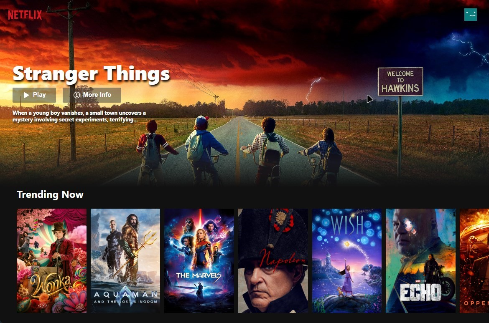

<a name="readme-top"></a>

<!-- [![Contributors][contributors-shield]][contributors-url] -->
<!-- [![Forks][forks-shield]][forks-url] -->
<!-- [![Stargazers][stars-shield]][stars-url] -->
<!-- [![Issues][issues-shield]][issues-url] -->

[![MIT License][license-shield]][license-url]
[![LinkedIn][linkedin-shield]][linkedin-url]
[![Github][Neilio3264]][Github-url]

<!-- PROJECT LOGO -->
<br />
<div align="center">
  <a href="https://github.com/Neilio3264/FilmFlix">
    
  </a>

  <h3 align="center">Netflix Clone</h3>

  <p align="center">
    A near one-for-one visual clone of the Netflix app with payment and subscriptions.
    <br />
    <a href="https://github.com/Neilio3264/netflix"><strong>Explore the docs »</strong></a>
    <br />
    <br />
    <a href="">View Demo</a>
  </p>
</div>

<!-- TABLE OF CONTENTS -->
<details>
  <summary>Table of Contents</summary>
  <ol>
    <li>
      <a href="#about-the-project">About The Project</a>
      <ul>
        <li><a href="#built-with">Built With</a></li>
      </ul>
    </li>
    <li>
      <a href="#getting-started">Getting Started</a>
      <ul>
        <li><a href="#prerequisites">Prerequisites</a></li>
        <li><a href="#installation">Installation</a></li>
      </ul>
    </li>
    <li><a href="#usage">Usage</a></li>
    <li><a href="#roadmap">Roadmap</a></li>
    <!-- <li><a href="#contributing">Contributing</a></li> -->
    <li><a href="#license">License</a></li>
    <li><a href="#contact">Contact</a></li>
    <!-- <li><a href="#acknowledgments">Acknowledgments</a></li> -->
  </ol>
</details>

<!-- ABOUT THE PROJECT -->

## About The Project

<div align="center">
  <a href="https://netflix-e5188.web.app/">
      
  </a>
</div>

The goal of this app was to build and showcase my talents as a software developer. I wanted to build an application that implements production level features like authentication, payment portals, and NoSQL database management.

Thus, while watching Netflix, I made the decision to create Netflix.

Although I mention the desire to create a production ready application, I recognize that this app is not quite production ready. However, it does do a great job of showcasing my coding proficiency while implementing a bulk of Netflix's webpage features.

- Login and logout authentication flow using Google Firebase Authentication
- Beautiful and intuitive component based webpages using React
- An active subscription workflow that can manage monthly subscription data
- Utilized Stripe payment processing to create a checkout flow
- Synchronized Google Firestore user data to Stripe payments
- Deployed webpage to Google Firebase Hosting

<p align="right">(<a href="#readme-top">back to top</a>)</p>

### Built With

#### Frontend Frameworks

- [![Figma][Figma]][Figma-url]
- [![React][React.js]][React-url]

#### Backend Frameworks

- [![Node JS][Node JS]][Node JS-url]
- [![Postman][Postman]][Postman-url]
- [![Axios][Axios]][Axios-url]
- [![React Router][React Router]][React Router-url]
- [![Redux][Redux]][Redux-url]

#### Database

- [![Firebase][Firebase]][Firebase-url]

#### Cloud Resources

- [![Google Cloud][Google Cloud]][Google Cloud-url]

#### Additional Integrations

- [![Stripe][Stripe]][Stripe-url]

#### Languages

- [![Javascript][Javascript]][Javascript-url]
- [![TypeScript][TypeScript]][TypeScript-url]
- [![Html][Html]][Html-url]
- [![CSS][CSS]][CSS-url]
- [![Json][Json]][Json-url]

#### Linters

- [![ESLint][ESLint]][ESLint-url]
- [![Prettier][Prettier]][Prettier-url]

#### IDE

- [![VSCode][VSCode]][VSCode-url]

<p align="right">(<a href="#readme-top">back to top</a>)</p>

<!-- GETTING STARTED -->

## Getting Started

[![Netflix Clone Link][Netflix]][Netflix-url]

To begin and test the application, click the button above. **_The button will take you to the cloned website, not the official Netflix website_**

Upon load, the website will check to see if you are an authorized user. If not, you will be taken to the Landing/Sign Up page. If you would like to sign in and look into the other features of the application, feel free to use the login information below.

```
  Email     : neil@gmail.com
  Password  : abcabc
```

_If you reload the page, you should have persistent logon._

The following home screen will scrap data from [TMDB](https://www.themoviedb.org/) and populate each recommendation section. There are no additional features past the frontend at this time.

Other screens to view:

- Profile Page
- Subscription Payment

```
For Stripe Payment Processing:
    Card Number   : 4242 4242 4242 4242
    Month         : 04/24
    CVC           : 424

All other information can be random
```

<p align="right">(<a href="#readme-top">back to top</a>)</p>

<!-- LICENSE -->

## License

Distributed under the MIT License. See `LICENSE.txt` for more information.

<p align="right">(<a href="#readme-top">back to top</a>)</p>

<!-- CONTACT -->

## Contact

[![Instagram][@neilrathod11]][Instagram-url] [![Gmail][neilrathod12]][Gmail-url]

Project Link: [https://github.com/Neilio3264/netflix](https://github.com/Neilio3264/netflix)

<p align="right">(<a href="#readme-top">back to top</a>)</p>

[Netflix]: https://img.shields.io/badge/Netflix-E50914?style=for-the-badge&logo=netflix&logoColor=white
[Netflix-url]: https://netflix-e5188.web.app/
[license-shield]: https://img.shields.io/github/license/othneildrew/Best-README-Template.svg?style=for-the-badge
[license-url]: https://github.com/Neilio3264/netflix/blob/master/LICENSE.txt
[linkedin-shield]: https://img.shields.io/badge/-LinkedIn-black.svg?style=for-the-badge&logo=linkedin&colorB=555
[linkedin-url]: https://linkedin.com/in/neilrathod
[Neilio3264]: https://img.shields.io/badge/github-%23121011.svg?style=for-the-badge&logo=github&logoColor=white
[GitHub-url]: https://github.com/Neilio3264
[@neilrathod11]: https://img.shields.io/badge/Instagram-%23E4405F.svg?style=for-the-badge&logo=Instagram&logoColor=white
[Instagram-url]: https://instagram.com/neilrathod11
[neilrathod12]: https://img.shields.io/badge/Gmail-D14836?style=for-the-badge&logo=gmail&logoColor=white
[Gmail-url]: mailto:neilrathod12@gmail.com
[product-screenshot]: src/assets/misc/homepage.jpg

<!-- Frontend -->

[Figma]: https://img.shields.io/badge/figma-%23F24E1E.svg?style=for-the-badge&logo=figma&logoColor=white
[Figma-url]: https://www.figma.com/
[React.js]: https://img.shields.io/badge/React-20232A?style=for-the-badge&logo=react&logoColor=61DAFB
[React-url]: https://reactjs.org/

<!-- Backend -->

[Node JS]: https://img.shields.io/badge/Node%20js-339933?style=for-the-badge&logo=nodedotjs&logoColor=white
[Node JS-url]: https://nodejs.org/
[Postman]: https://img.shields.io/badge/Postman-FF6C37?style=for-the-badge&logo=Postman&logoColor=white
[Postman-url]: https://www.postman.com/
[Axios]: https://img.shields.io/badge/axios-671ddf?&style=for-the-badge&logo=axios&logoColor=white
[Axios-url]: https://axios-http.com/
[React Router]: https://img.shields.io/badge/React_Router-CA4245?style=for-the-badge&logo=react-router&logoColor=white
[React Router-url]: https://reactrouter.com/
[Redux]: https://img.shields.io/badge/Redux-593D88?style=for-the-badge&logo=redux&logoColor=white
[Redux-url]: https://redux.js.org/

<!-- Database -->

[Firebase]: https://img.shields.io/badge/firebase-ffca28?style=for-the-badge&logo=firebase&logoColor=black
[Firebase-url]: https://firebase.google.com/

<!-- Cloud -->

[Google Cloud]: https://img.shields.io/badge/Google_Cloud-4285F4?style=for-the-badge&logo=google-cloud&logoColor=white
[Google Cloud-url]: https://cloud.google.com/

<!-- Languages -->

[TypeScript]: https://img.shields.io/badge/TypeScript-007ACC?style=for-the-badge&logo=typescript&logoColor=white
[TypeScript-url]: https://www.typescriptlang.org/
[Json]: https://img.shields.io/badge/json-5E5C5C?style=for-the-badge&logo=json&logoColor=white
[Json-url]: https://www.json.org/json-en.html
[Javascript]: https://img.shields.io/badge/JavaScript-323330?style=for-the-badge&logo=javascript&logoColor=F7DF1E
[Javascript-url]: https://www.javascript.com/
[Html]: https://img.shields.io/badge/HTML5-E34F26?style=for-the-badge&logo=html5&logoColor=white
[Html-url]: https://html.spec.whatwg.org/
[CSS]: https://img.shields.io/badge/CSS3-1572B6?style=for-the-badge&logo=css3&logoColor=white
[CSS-url]: https://www.w3.org/TR/CSS/#css

<!-- Linters -->

[ESLint]: https://img.shields.io/badge/eslint-3A33D1?style=for-the-badge&logo=eslint&logoColor=white
[ESLint-url]: https://eslint.org/
[Prettier]: https://img.shields.io/badge/prettier-1A2C34?style=for-the-badge&logo=prettier&logoColor=F7BA3E
[Prettier-url]: https://prettier.io/

<!-- Additional Integrations -->

[Stripe]: https://img.shields.io/badge/Stripe-626CD9?style=for-the-badge&logo=Stripe&logoColor=white
[Stripe-url]: https://stripe.com/

<!-- IDE -->

[VSCode]: https://img.shields.io/badge/VSCode-0078D4?style=for-the-badge&logo=visual%20studio%20code&logoColor=white
[VSCode-url]: https://code.visualstudio.com/
